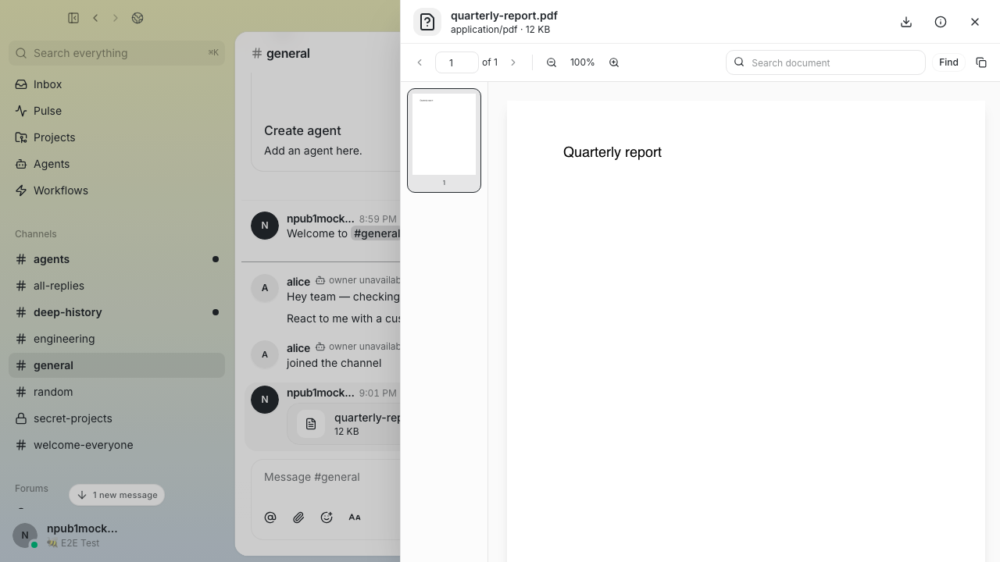
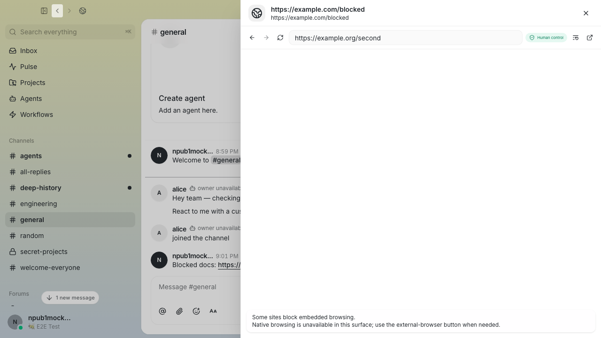

# ASV Buzz workspace feature evidence

These screenshots are deterministic Playwright outputs from the workspace
acceptance cases. They demonstrate the tested rendered states; they do not
replace the separately pending named-human native visual, keyboard, and
accessibility acceptance gate.

## Bundled PDF.js reader

The PDF attachment remains visible in its originating thread while the bundled
reader opens in the right-side workspace.

## Persistent workspace browser

The browser preserves the channel/thread composition and presents its controller
state and structured fallback message inside the workspace.
